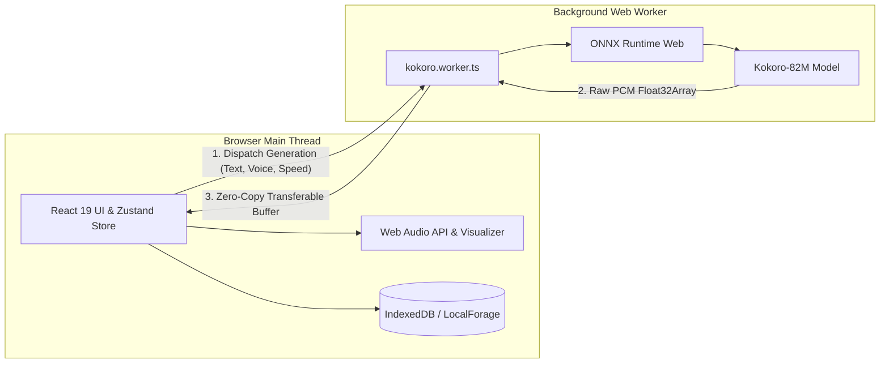

# Edge AI Voice Studio 🎙️⚡

An on-device, private, client-side Text-to-Speech (TTS) studio powered by **Kokoro-82M ONNX**, running natively in the browser via **WebGPU** and **WebAssembly (WASM)**.

[](https://react.dev)
[](https://www.typescriptlang.org/)
[](https://vitejs.dev/)
[](https://www.w3.org/TR/webgpu/)
[](https://developer.mozilla.org/en-US/docs/Web/API/Web_Workers_API)

---

## ✨ Key Features

- 🧠 **100% On-Device Neural Synthesis**: Runs an 82M-parameter Kokoro TTS ONNX model directly inside your browser. No server calls, no API keys, and 100% privacy.
- ⚡ **Zero UI Freezing (Web Worker Architecture)**: Model loading and inference are isolated in a background Web Worker using Transferable Objects (ArrayBuffers) for zero-copy memory transfer, maintaining smooth 60 FPS UI responsiveness.
- 🚀 **Hardware Acceleration & Smart Fallbacks**:
  - Primary: **WebGPU** for ultra-fast GPU inference.
  - Automatic Fallback: **WebAssembly (WASM SIMD)** for CPU execution.
- 🎚️ **Web Audio Engine**: Real-time waveform visualization, dynamic playback speed, pitch control, and direct audio export (WAV/MP3).
- 💾 **Offline History & Storage**: Persists generated audio tracks locally using **IndexedDB / LocalForage**.
- 🎨 **Modern Interface**: Designed with dark mode glassmorphism, responsive controls, and smooth animations using TailwindCSS and Framer Motion.

---

## 🛠️ Tech Stack

- **Framework**: React 19, TypeScript
- **State Management**: Zustand
- **AI / ML Runtime**: `kokoro-js`, ONNX Runtime Web
- **Audio Processing**: Native Web Audio API (PCM buffers, AudioContext)
- **Styling & UI**: TailwindCSS v4, Lucide Icons, Framer Motion
- **Storage**: LocalForage (IndexedDB)
- **Testing**: Vitest, React Testing Library

---

## 🏗️ Architecture Overview



---

## 🚀 Getting Started

### Prerequisites
- Node.js 18+
- npm or yarn

### Installation

1. **Clone the repository:**
   ```bash
   git clone https://github.com/anupamsinha18/Edge-AI-Voice-Studio.git
   cd Edge-AI-Voice-Studio
   ```

2. **Install dependencies:**
   ```bash
   npm install
   ```

3. **Start the local development server:**
   ```bash
   npm run dev
   ```

4. **Build for production:**
   ```bash
   npm run build
   ```

5. **Run tests:**
   ```bash
   npm run test:run
   ```

---

## 🔒 Privacy & Security

Unlike traditional cloud-based TTS services, **Edge AI Voice Studio does not transmit any text or generated voice recordings over the network**. All calculations happen locally inside your browser's execution sandbox.

---

## 📄 License

MIT License. Free to use and contribute!
